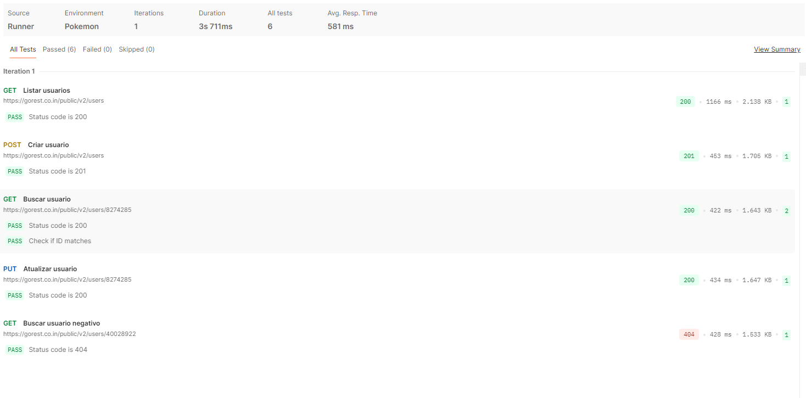

Testes Automatizados no Postman
===============================

Segue coleção do **Postman** desenvolvida para o segundo exerciício da prova prática da disciplina S206, com o objetivo de validar operações CRUD na API pública **GoRest** utilizando o **Postman**.A coleção inclui testes automatizados, uso de variáveis globais e autenticação via Bearer Token.

**Funcionalidades Testadas**
----------------------------

A coleção realiza os seguintes testes:

### ✔ **1\. Listar usuários**

*   Método: GET
    
*   Valida se a resposta retorna com status **200 OK**
    

### ✔ **2\. Criar usuário**

*   Método: POST
    
*   Envia os dados de um novo usuário com as seguintes propriedades:
    
    *   name
        
    *   gender
        
    *   email (deve ser único)
        
    *   status
        
*   Valida resposta **201 Created**
    
*   Salva automaticamente o id criado em uma variável global user\_id para ser usado nos próximos casos de teste.
    

### ✔ **3\. Buscar usuário pelo ID (positivo)**

*   Método: GET
    
*   Utiliza {{user\_id}}
    
*   Valida status **200 OK**
    
*   Valida se o ID retornado realmente corresponde ao usuário criado.
    

### ✔ **4\. Atualizar usuário**

*   Método: PUT
    
*   Atualiza os dados do usuário existente
    
*   Valida status **200 OK**
    

### ✔ **5\. Buscar usuário inexistente (negativo)**

*   Método: GET
    
*   Utiliza um ID inválido
    
*   Valida status **404 Not Found**
    

Resultado dos Testes
--------------------

